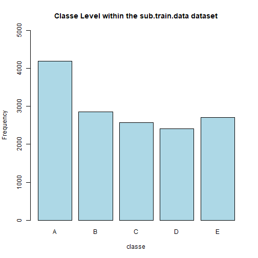
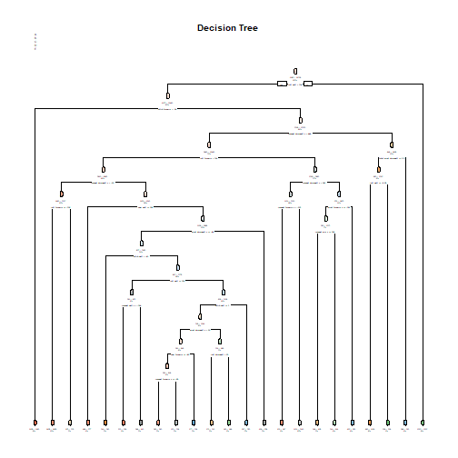

## Abstract

Using devices such as Jawbone Up, Nike FuelBand, and Fitbit it is now possible to collect a large amount of data about personal activity relatively inexpensively. These type of devices are part of the quantified self movement - a group of enthusiasts who take measurements about themselves regularly to improve their health, to find patterns in their behavior, or because they are tech geeks. One thing that people regularly do is quantifying how much of a particular activity they do, but they rarely quantify how well they do it. In this project, I will be using data from accelerometers on the belt, forearm, arm, and dumbbell of 6 participants. They were asked to perform barbell lifts correctly and incorrectly in 5 different ways. More information is available from the website here: <http://web.archive.org/web/20161224072740/http:/groupware.les.inf.puc-rio.br/har> (see the section on the Weight Lifting Exercise Dataset).

## Data Source

Train Data: <https://d396qusza40orc.cloudfront.net/predmachlearn/pml-training.csv>

Test Data: <https://d396qusza40orc.cloudfront.net/predmachlearn/pml-testing.csv>

More info: <http://web.archive.org/web/20161224072740/http:/groupware.les.inf.puc-rio.br/har>

## Technique

"classe" variable is the outcome (what I try to predict). This data set collects information about participants who were asked to perform one set of 10 repetitions of the Unilateral Dumbbell Biceps Curl in 5 different fashions:

* Class A: exactly according to the specification

* Class B: throwing the elbows to the front

* Class C: lifting the dumbbell only halfway

* Class D: lowering the dumbbell only halfway

* Class E: throwing the hips to the front

I will be building Decision Tree and Random Forest models. And will submit the model with the highest accuracy. To measure accuracy, I will be using cross-validation (subset again the train dataset to 75% train data [call it "SubTrainData"] and 25% test data [call it "SubTestData"]).


The expected out-of-sample error will correspond to the quantity: 1-accuracy in the cross-validation data. Accuracy is the proportion of correct classified observation over the total sample in the SubTestData data set. Expected accuracy is the expected accuracy in the out-of-sample dataset (i.e. original test data set). Thus, the expected value of the out-of-sample error will correspond to the expected number of missclassified observations/total observations in the Test dataset, which is the quantity: 1-accuracy found from the cross-validation data set.

## Preprocessing


```r
# load package 
library(lattice)
```

```
## Warning: package 'lattice' was built under R version 3.4.4
```

```r
library(ggplot2)
```

```
## Warning: package 'ggplot2' was built under R version 3.4.4
```

```r
library(caret)
```

```
## Warning: package 'caret' was built under R version 3.4.4
```

```r
library(randomForest)
```

```
## Warning: package 'randomForest' was built under R version 3.4.4
```

```
## randomForest 4.6-14
```

```
## Type rfNews() to see new features/changes/bug fixes.
```

```
## 
## Attaching package: 'randomForest'
```

```
## The following object is masked from 'package:ggplot2':
## 
##     margin
```

```r
library(rpart)
library(rpart.plot)
```

```
## Warning: package 'rpart.plot' was built under R version 3.4.4
```


```r
set.seed(1234)

# load and clean data
train.data <- read.csv("pml-training.csv", na.strings = c("NA", "#DIV/0!", ""))
test.data <- read.csv("pml-testing.csv", na.strings = c("NA", "#DIV/0!", ""))

dim(train.data)
```

```
## [1] 19622   160
```

```r
dim(test.data) 
```

```
## [1]  20 160
```


```r
# Remove columns with all missing values
train.data <- train.data[,colSums(is.na(train.data)) == 0]
test.data <- test.data[,colSums(is.na(test.data)) == 0]

# Remove irrelevant variables: user_name, raw_timestamp_part_1, raw_timestamp_part_,2 cvtd_timestamp, new_window, and num_window (columns 1 to 7). 
train.data   <- train.data[,-c(1:7)]
test.data <- test.data[,-c(1:7)]

# partition the original train dataset into 75% training dataset and 25% test dataset
sub.train <- createDataPartition(y=train.data$classe, p=0.75, list=FALSE)
sub.train.data <- train.data[sub.train, ] 
sub.test.data <- train.data[-sub.train, ]

# The variable "classe" contains 5 levels: A, B, C, D and E. Draw a bar plot to show the frequency of each class level
plot(sub.train.data$classe, col=" light blue", main="Classe Level within the sub.train.data dataset", xlab="classe", ylab="Frequency", ylim = c(0,5000))
```



The graph shows that Classe A is the most frequent level while Classe D is least frequent. 

## Decision Tree

```r
tree.model <- rpart(classe ~ ., data=sub.train.data, method="class")
tree.prediction <- predict(tree.model, sub.test.data, type = "class")

# Plot the Decision Tree
rpart.plot(tree.model, main="Decision Tree", extra=102, under=TRUE, faclen=0)
```



(Go to the "figure" file in my repository, zoom in to see a larger graph)


```r
# Test results on our sub.test.data dataset:
confusionMatrix(tree.prediction, sub.test.data$classe)
```

```
## Confusion Matrix and Statistics
## 
##           Reference
## Prediction    A    B    C    D    E
##          A 1235  157   16   50   20
##          B   55  568   73   80  102
##          C   44  125  690  118  116
##          D   41   64   50  508   38
##          E   20   35   26   48  625
## 
## Overall Statistics
##                                           
##                Accuracy : 0.7394          
##                  95% CI : (0.7269, 0.7516)
##     No Information Rate : 0.2845          
##     P-Value [Acc > NIR] : < 2.2e-16       
##                                           
##                   Kappa : 0.6697          
##  Mcnemar's Test P-Value : < 2.2e-16       
## 
## Statistics by Class:
## 
##                      Class: A Class: B Class: C Class: D Class: E
## Sensitivity            0.8853   0.5985   0.8070   0.6318   0.6937
## Specificity            0.9307   0.9216   0.9005   0.9529   0.9678
## Pos Pred Value         0.8356   0.6469   0.6313   0.7247   0.8289
## Neg Pred Value         0.9533   0.9054   0.9567   0.9296   0.9335
## Prevalence             0.2845   0.1935   0.1743   0.1639   0.1837
## Detection Rate         0.2518   0.1158   0.1407   0.1036   0.1274
## Detection Prevalence   0.3014   0.1790   0.2229   0.1429   0.1538
## Balanced Accuracy      0.9080   0.7601   0.8537   0.7924   0.8307
```

## Random Forest

```r
rf.model <- randomForest(classe ~., data=sub.train.data, method="class")

# Predicting:
rf.prediction <- predict(rf.model, sub.test.data, type = "class")

# Test results on sub.test.data dataset:
confusionMatrix(rf.prediction, sub.test.data$classe)
```

```
## Confusion Matrix and Statistics
## 
##           Reference
## Prediction    A    B    C    D    E
##          A 1395    3    0    0    0
##          B    0  943   10    0    0
##          C    0    3  844    5    0
##          D    0    0    1  799    0
##          E    0    0    0    0  901
## 
## Overall Statistics
##                                           
##                Accuracy : 0.9955          
##                  95% CI : (0.9932, 0.9972)
##     No Information Rate : 0.2845          
##     P-Value [Acc > NIR] : < 2.2e-16       
##                                           
##                   Kappa : 0.9943          
##  Mcnemar's Test P-Value : NA              
## 
## Statistics by Class:
## 
##                      Class: A Class: B Class: C Class: D Class: E
## Sensitivity            1.0000   0.9937   0.9871   0.9938   1.0000
## Specificity            0.9991   0.9975   0.9980   0.9998   1.0000
## Pos Pred Value         0.9979   0.9895   0.9906   0.9988   1.0000
## Neg Pred Value         1.0000   0.9985   0.9973   0.9988   1.0000
## Prevalence             0.2845   0.1935   0.1743   0.1639   0.1837
## Detection Rate         0.2845   0.1923   0.1721   0.1629   0.1837
## Detection Prevalence   0.2851   0.1943   0.1737   0.1631   0.1837
## Balanced Accuracy      0.9996   0.9956   0.9926   0.9968   1.0000
```

## Which Model to Use?

I will be using Random Forest Model as it has higher accuracy than the Decision Tree Model:

* Random Forest: Accuracy: 0.9955; 95% CI: (0.9932, 0.9972)

* Decision Tree: Accuracy: 0.7394; 95% CI : (0.7269, 0.7516)

The expected out-of-sample error is estimated at 0.005, or 0.5%.

## Submission of Random Forest Model to the Original Test Dataset

```r
# predict outcome levels on the original Testing data set
final.prediction <- predict(rf.model, test.data, type="class")
final.prediction
```

```
##  1  2  3  4  5  6  7  8  9 10 11 12 13 14 15 16 17 18 19 20 
##  B  A  B  A  A  E  D  B  A  A  B  C  B  A  E  E  A  B  B  B 
## Levels: A B C D E
```
